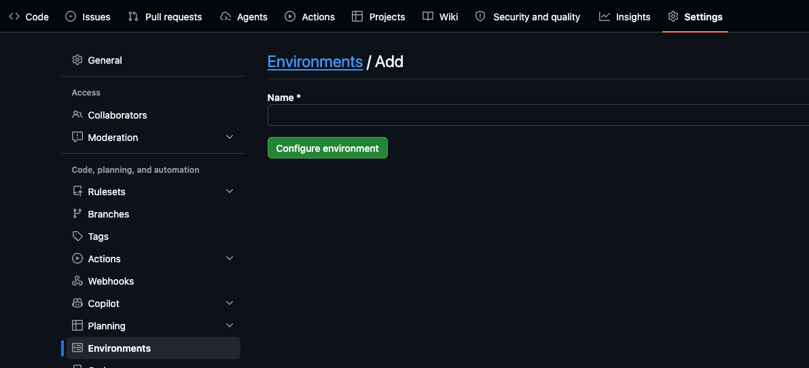
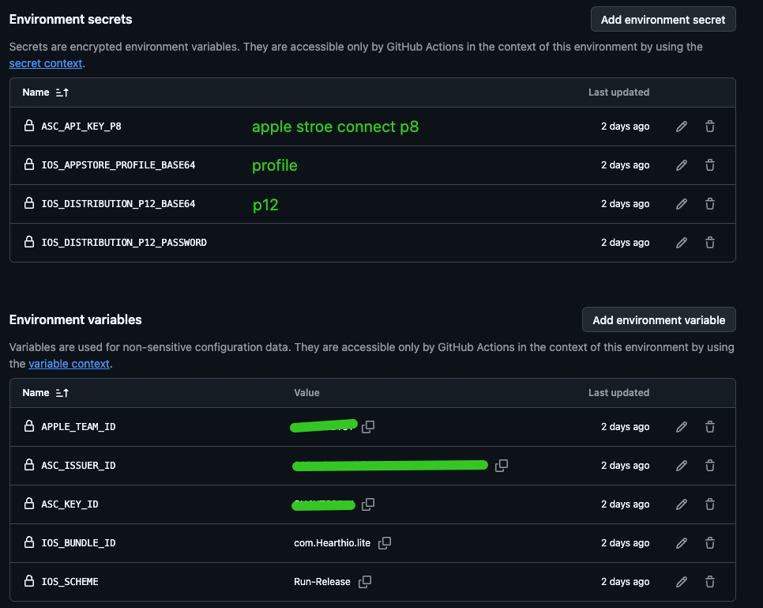

# GitHub Actions iOS 自动打包配置说明

本文把 GitHub Environment、签名材料、App Store Connect 参数和自动打包流程整理为一份可直接执行的接入说明。参数名称以当前仓库的 composite action、示例 workflow 和 `.github/ios-build.yml` 为准；截图只用于说明 GitHub 页面位置，截图中的名称和值不能直接照抄。

## 1. 配置组成

每个 App 仓库需要准备三类内容：

1. 受保护的 GitHub Environment：控制谁能批准生产构建、允许哪些分支或 Tag 使用发布凭据。
2. Environment secrets：保存 `.p12`、profiles 压缩包、`.p8` 和相关认证参数。
3. 仓库内非敏感配置：保存 Team ID、Bundle ID、Scheme、Xcode、版本策略和上传策略。

推荐目录：

```text
.github/
  ios-build.yml
  app-store-metadata.yml
  workflows/
    ios-release.yml
```

## 2. 创建 GitHub Environment

进入 App 仓库：`Settings` → `Environments` → `New environment`，填写 workflow 将要引用的 Environment 名称，例如 `app-production`。



Environment 名称必须与 workflow 中的配置完全一致：

```yaml
jobs:
  release:
    environment: app-production
```

生产 Environment 建议同时配置：

- Required reviewers。
- Prevent self-review。
- 允许部署的受保护分支和 Tag，例如 `main`、`release/*`、`ios-v*`。
- 如果组织流程允许，禁止管理员绕过保护规则。

Environment 审批通过前，job 不能读取这里保存的 secrets。审批人仍需核对本次运行的精确 `github.ref` 和完整 `github.sha`，不能只看分支名称。

## 3. Secrets 与非敏感参数

下面截图展示了 Environment secrets 和 Environment variables 的页面位置。绿色内容为示意或已遮挡值，不应复制到其他 App。



### 3.1 当前仓库使用的 Environment secrets

| 名称 | 内容 | 何时需要 | 填写方式 |
|---|---|---|---|
| `IOS_DISTRIBUTION_P12_BASE64` | Apple Distribution 证书与私钥导出的 `.p12` | 所有签名构建 | `.p12` 文件 Base64 单行文本 |
| `IOS_DISTRIBUTION_P12_PASSWORD` | 导出 `.p12` 时设置的密码 | 所有签名构建 | 原始密码，不做 Base64 |
| `IOS_PROFILES_ARCHIVE_BASE64` | 目标 App 及扩展所需的全部 `.mobileprovision` | 所有签名构建 | 只含 profiles 的 `tar.gz` Base64 单行文本 |
| `ASC_API_KEY_P8_BASE64` | App Store Connect Team API 私钥 `.p8` | ASC build number、上传、状态查询或提审 | `.p8` 文件 Base64 单行文本 |
| `ASC_KEY_ID` | App Store Connect API Key ID | 使用 ASC API 时 | 10 位大写字母或数字；按当前模板存为 Secret |
| `ASC_ISSUER_ID` | App Store Connect Team API Issuer ID | 使用 Team API Key 时 | UUID；按当前模板存为 Secret |
| `ASC_REVIEW_DEMO_ACCOUNT_NAME` | App Review 演示账号 | 审核需要登录时 | 可选 Secret |
| `ASC_REVIEW_DEMO_ACCOUNT_PASSWORD` | App Review 演示密码 | 审核需要登录时 | 可选 Secret |

标准示例使用 `versioning.build_number_strategy: asc_increment`。在这种配置下，即使本次 `upload_to_asc=false`，只要没有手动传入 build number，也需要 ASC 三项凭据来查询下一个 build number。若显式提供 build number 且不上传 ASC，才可以不读取 ASC 凭据。

### 3.2 截图名称与当前接口的映射

| 截图中的名称 | 当前应使用的位置或名称 | 说明 |
|---|---|---|
| `ASC_API_KEY_P8` | `ASC_API_KEY_P8_BASE64` Secret | 当前 Action 明确接收 Base64 后的 `.p8` |
| `IOS_APPSTORE_PROFILE_BASE64` | `IOS_PROFILES_ARCHIVE_BASE64` Secret | 当前 Action 接收 `tar.gz`；即使只有一个 profile 也要先打包 |
| `IOS_DISTRIBUTION_P12_BASE64` | 同名 Secret | 名称一致 |
| `IOS_DISTRIBUTION_P12_PASSWORD` | 同名 Secret | 保存原始 `.p12` 密码 |
| `APPLE_TEAM_ID` | `.github/ios-build.yml` 的 `app.team_id` | 当前参考 workflow 不读取同名 Environment variable |
| `ASC_ISSUER_ID` | 同名 Secret | 当前参考 workflow 使用 `secrets.ASC_ISSUER_ID` |
| `ASC_KEY_ID` | 同名 Secret | 当前参考 workflow 使用 `secrets.ASC_KEY_ID` |
| `IOS_BUNDLE_ID` | `app.primary_bundle_id` 与 `app.bundle_ids` | 每个扩展 Bundle ID 都要单独列出 |
| `IOS_SCHEME` | `build.scheme` | 必须是共享且可在 runner 上发现的 Scheme |

截图中的 `com.Hearthio.lite`、`Run-Release` 仅代表截图对应 App 的示例值。新 App 必须填写自身真实 Bundle ID 和 Scheme。

## 4. 准备 Base64 Secrets

### 4.1 通用 macOS 命令

对 `.p12`、`.p8` 或已经打包好的 profiles 压缩包，可使用：

```bash
base64 -i "证书或压缩包在电脑上的绝对路径" | tr -d '\n' | pbcopy
```

命令会把无换行的 Base64 内容写入剪贴板，随后粘贴到对应 Environment secret。不要把输出打印到终端、聊天或日志中。

### 4.2 Apple Distribution `.p12`

在“钥匙串访问”中找到有效的 `Apple Distribution` 证书，展开后确认存在对应私钥，再把证书和私钥一起导出为 `.p12`。

编码：

```bash
base64 -i "/absolute/path/AppleDistribution.p12" | tr -d '\n' | pbcopy
```

粘贴到 `IOS_DISTRIBUTION_P12_BASE64`，导出密码原样保存到 `IOS_DISTRIBUTION_P12_PASSWORD`。

可在本机预检：

```bash
openssl pkcs12 -legacy -in "/absolute/path/AppleDistribution.p12" -info -noout
```

### 4.3 Provisioning profiles

主 App、Widget、Notification Service、Share Extension、Watch App 或 App Clip 等独立 Target，通常各自需要匹配 Bundle ID、Team、证书与 Entitlements 的 App Store Connect distribution profile。

把本 App 所需的 `.mobileprovision` 放到一个只含 profile 的目录，然后执行：

```bash
cd "/absolute/path/to/profile-directory"
tar -czf ios-profiles.tar.gz ./*.mobileprovision
base64 -i ios-profiles.tar.gz | tr -d '\n' | pbcopy
```

粘贴到 `IOS_PROFILES_ARCHIVE_BASE64`。不要把单个 `.mobileprovision` 直接粘贴到截图中的旧名称；当前脚本会把 Secret 解码为 `tar.gz` 并拒绝其中的非 profile 文件、链接、路径穿越、超过 64 个文件或解压后超过 10 MiB 的内容。

编码后可先检查大小：

```bash
base64 -i ios-profiles.tar.gz | tr -d '\n' | wc -c
```

GitHub 单个 Secret 存在大小限制；若接近或超过仓库完整设计文档说明的限制，应按该文档的大 Secret 方案处理，不要截断 Base64。

### 4.4 App Store Connect `.p8`

在 App Store Connect → Users and Access → Integrations → Team Keys 创建满足最小权限要求的 API Key，下载只能获取一次的 `.p8`，并记录 Key ID 与 Issuer ID。

编码：

```bash
base64 -i "/absolute/path/AuthKey_XXXXXXXXXX.p8" | tr -d '\n' | pbcopy
```

粘贴到 `ASC_API_KEY_P8_BASE64`。Key ID 保存为 `ASC_KEY_ID`，Team API Key 的 Issuer ID 保存为 `ASC_ISSUER_ID`。

可在本机预检私钥：

```bash
openssl pkey -in "/absolute/path/AuthKey_XXXXXXXXXX.p8" -check -noout
```

不要把 `.p12`、`.p8`、`.mobileprovision`、Base64 内容或密码提交到 Git，即使仓库是私有的。

## 5. 配置非敏感构建参数

复制 [`examples/app-repository/.github/ios-build.yml`](../examples/app-repository/.github/ios-build.yml) 到 App 仓库的 `.github/ios-build.yml`，至少替换以下字段：

```yaml
app:
  name: ExampleApp
  team_id: ABCDE12345
  asc_app_id: "1234567890"
  primary_bundle_id: com.example.app
  bundle_ids:
    - bundle_id: com.example.app
      target: ExampleApp
      profile_alias: app

build:
  container_type: workspace
  container_path: ExampleApp.xcworkspace
  scheme: ExampleApp
  configuration: Release
  runner: macos-26
  xcode_path: /Applications/Xcode_26.4.app
  dependency_mode: cocoapods
  dependency_command: ""
```

关键要求：

- `asc_app_id` 是 App Store Connect 中 App 资源的数字 ID，不是 Bundle ID。
- `team_id`、Bundle ID、Target、profile 和 Entitlements 必须一致。
- 所有需要签名的 Target 都要列入 `app.bundle_ids`。
- `container_path`、Scheme 和 Xcode 路径必须在选定 runner 上真实存在。
- `build.runner` 是配置审计值，workflow 的 `runs-on` 仍需单独设置，并与它保持一致。
- `profile_alias` 只是映射标签，不是 Secret 名称。

当前参考实现不读取截图里的 `APPLE_TEAM_ID`、`IOS_BUNDLE_ID` 或 `IOS_SCHEME` Environment variables；把这些值只配置成 variables 不会改变构建。除非自定义 workflow 显式读取 `${{ vars.* }}` 并生成配置，否则应以 `.github/ios-build.yml` 为准。

## 6. 配置发布 Workflow

复制 [`examples/app-repository/.github/workflows/ios-release.yml`](../examples/app-repository/.github/workflows/ios-release.yml) 到 App 仓库，并完成三项替换：

1. `environment` 改为第 2 节创建的 Environment 名称。
2. `runs-on` 与 `.github/ios-build.yml` 的 `build.runner` 保持一致。
3. `<PINNED_FULL_COMMIT_SHA>` 替换为本仓库经过审核的完整 commit SHA；不要使用 `main`、功能分支名或可移动 Tag。

workflow 中的关键接线应保持为：

```yaml
with:
  config_path: .github/ios-build.yml
  ios_distribution_p12_base64: ${{ secrets.IOS_DISTRIBUTION_P12_BASE64 }}
  ios_distribution_p12_password: ${{ secrets.IOS_DISTRIBUTION_P12_PASSWORD }}
  ios_profiles_archive_base64: ${{ secrets.IOS_PROFILES_ARCHIVE_BASE64 }}
  asc_api_key_p8_base64: ${{ secrets.ASC_API_KEY_P8_BASE64 }}
  asc_key_id: ${{ secrets.ASC_KEY_ID }}
  asc_issuer_id: ${{ secrets.ASC_ISSUER_ID }}
```

## 7. 自动打包流程

```text
Actions 手动触发 workflow_dispatch
  → 校验输入、运行分支/Tag、源码 SHA、配置 Schema 和工具链
  → 必要时通过 ASC 计算下一个 build number
  → 安装锁定的 CocoaPods/SPM/Flutter 依赖
  → 解码 P12 与 profiles，创建临时 Keychain，核对证书/Profile/Bundle ID
  → Archive → Export IPA → 检查版本、Bundle ID、签名和导出结果
  → 先保存 IPA 与构建证据 Artifact
  → 可选上传 App Store Connect
  → 等待 Apple 处理，并可选同步商店资料、绑定 build、提交审核
  → 保存 ASC 状态与诊断 Artifact
  → 无论成功失败都清理临时 Keychain、profiles 和私钥
```

建议按风险从低到高分三次验证：

1. `upload_to_asc=false`：只验证配置、签名、Archive、Export、IPA 检查和 Artifact。
2. `upload_to_asc=true`、`submit_to_review=false`：验证上传和 ASC 处理，但不提交审核。
3. 确认商店资料与 build 正确后，再执行 `submit_to_review=true`。

## 8. 上线前检查清单

- [ ] workflow 的 `environment` 与 GitHub Environment 名称完全一致。
- [ ] 所有 Secrets 使用当前标准名称，没有沿用截图中的旧名称。
- [ ] Base64 内容为单行，未被截断，未复制命令提示符或额外空格。
- [ ] `.p12` 包含私钥，密码可用，证书未过期或撤销。
- [ ] profiles 压缩包只包含当前 App 所需的 `.mobileprovision`。
- [ ] 每个 Bundle ID、Target、profile、Team ID 和 Entitlements 一致。
- [ ] `ASC_KEY_ID` 为 10 位大写字母或数字，`ASC_ISSUER_ID` 为 Team Key UUID。
- [ ] Scheme 已共享，workspace/project 路径和 Xcode 路径正确。
- [ ] workflow 中中央 Action 固定到完整 commit SHA。
- [ ] 先完成不上传 ASC 的演练构建，再开启上传和提审。

更完整的安全设计、profile 检查、Secret 大小处理和失败原则见 [`ios-multi-app-cloud-build-system.md`](../ios-multi-app-cloud-build-system.md)。
